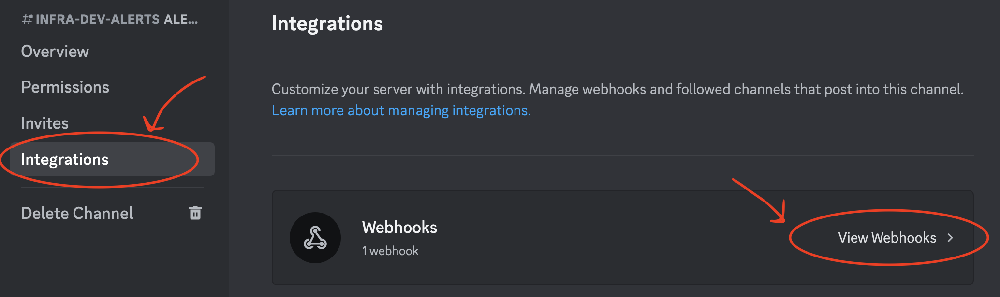
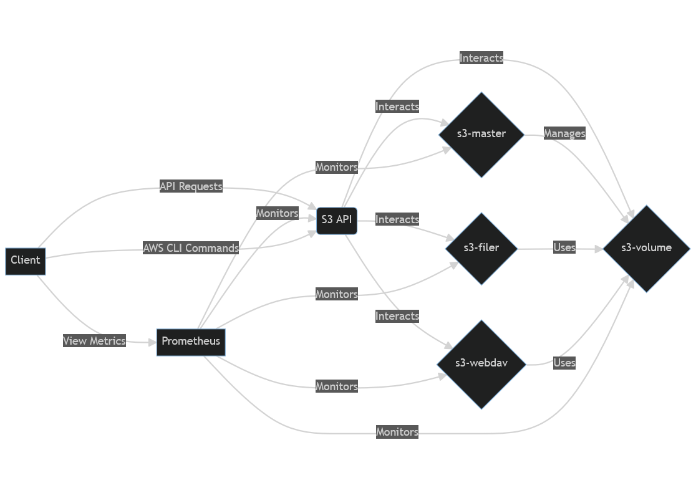

# Stamford Center
### Note
- this storage system uses mounted volume on host machine (named as `data`)\
- remove folder `data` to empty the storage system

## Prerequisites
- docker
- awscli - then type `aws configure` in the terminal and enter anything
- .env file with the following content
```
DISCORD_WEBHOOK_URL= <discord webhook url>
```
discord webhook url can be retrieved by:
1. Click `Edit Channel` on `#infra-dev-alerts` channel


2. `Integrations` > `View Webhooks`



3. Expand `Infra Bot` and click `Copy Webhook URL`


## Getting started
Start Dev Environment
```
docker-compose -f docker-compose.dev.yaml up -d
```
Stop Dev Environment
```
docker-compose -f docker-compose.dev.yaml down
```
Create new S3 Bucket
```
aws s3 mb s3://<bucket-name> --endpoint-url http://localhost:8333
```
See all buckets
```
aws s3 ls --endpoint-url http://localhost:8333
```
Upload file to S3
```
aws s3 cp <target-path> s3://<bucket-name>/<desired-path> --endpoint-url http://localhost:8333
```
Retrieve file from S3
```
aws s3 cp s3://<bucket-name>/<target-path> <desired-path> --endpoint-url http://localhost:8333
```


## Services

#### S3
- This service runs the SeaweedFS S3 server.
- The S3 server provides an Amazon S3-compatible interface to interact with 
SeaweedFS.
- The Prometheus metrics are exposed on port 9327.
- Access via `http://localhost:8333`

#### S3-master
- This service runs the SeaweedFS Master server.
- The master server is responsible for managing the metadata and coordinating the volume servers.
- It exposes ports 9333 for HTTP and 19333 for gRPC communication.
- The Prometheus metrics are exposed on port 9324.

#### S3-volume
- This service runs the SeaweedFS Volume server.
- The volume server stores the actual file data and is managed by the master server.
- It exposes ports 8181 for HTTP and 18080 for gRPC communication.
- The Prometheus metrics are exposed on port 9325.

#### S3-filer
- This service runs the SeaweedFS Filer server.
- The filer server provides the file system-like interface to access the data stored in the volume servers.
- It exposes ports 8888 for HTTP and 18888 for gRPC communication.
- The Prometheus metrics are exposed on port 9326.

#### S3-webdav:
- This service runs the SeaweedFS WebDAV server.
- The WebDAV server provides a WebDAV-compatible interface to access the data stored in SeaweedFS.
- It exposes port 7333 for HTTP communication.

#### Prometheus
- This service runs the Prometheus monitoring tool.
- It is responsible for collecting and storing metrics from different components of the SeaweedFS setup.
- Access via `http://localhost:9000`

#### AlertManager
- This service runs the Prometheus Alertmanager tool
- It is responsible for sending out alerts to specified urls when triggered by prometheus alerting system
- Unfortunately, its configuration file does not support environment variables, making it difficult to put in sensitive information like discord webhook url here
- Therefore, we set this service to send alert to `Discord-Alert` service through port `9094` where secrets can be stored safely
- Access via `http://localhost:9093`

#### Discord-Alert
- This service acts as a message forwarder from Alertmanager to Our Discord Channel
- To receive alerts from `AlertManager`, it listens to port `9094`
- Once received, the alerts will be forwarded to the `#infra-dev-alerts` channel on discord
- For this service to function properly, it requires `DISCORD_WEBHOOK_URL` defined as environment variable


## Bounded Ports
| PORT  | SERVICE                                       |
|------:|:---------------------------------------------|
| 7333  | S3-webdav service (SeaweedFS WebDAV server)  |
| 8181  | S3-volume service (SeaweedFS Volume server - HTTP API) |
| 8333  | S3 service (SeaweedFS S3 server)             |
| 8888  | S3-filer service (SeaweedFS Filer server - HTTP API) |
| 9000  | Prometheus service                           |
| 9093  | AlertManager service                         |
| 9094  | Discord-Alert service (Internal)             |
| 9324  | S3-master service (SeaweedFS Master server - Prometheus metrics) |
| 9325  | S3-volume service (SeaweedFS Volume server - Prometheus metrics) |
| 9326  | S3-filer service (SeaweedFS Filer server - Prometheus metrics) |
| 9327  | S3 service (SeaweedFS S3 server - Prometheus metrics) |
| 9333  | S3-master service (SeaweedFS Master server - HTTP API) |
| 18080 | S3-volume service (SeaweedFS Volume server - gRPC communication) |
| 18888 | S3-filer service (SeaweedFS Filer server - gRPC communication) |
| 19333 | S3-master service (SeaweedFS Master server - gRPC communication) |
